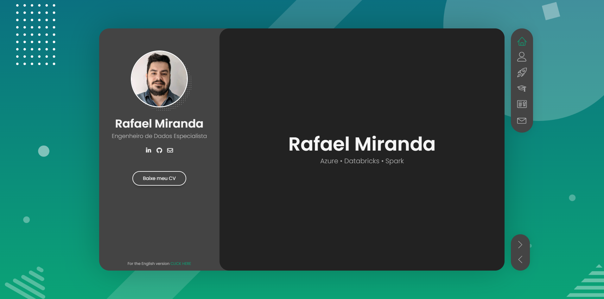

# rafaelxm.github.io

Personal portfolio and online CV of **Rafael Miranda** — Senior Data Engineer with 15+ years in IT, working with Azure, Databricks and Advanced Analytics.

**Live site:** [rafaelxm.github.io](https://rafaelxm.github.io)

<!-- Adicione um screenshot da home aqui:

-->

---

## About

A static, single-page site built to present my professional background, certifications and personal projects. It is served directly by GitHub Pages from the `main` branch — no build step, no dependencies to install.

The site is available in two languages:

| Language | File | URL |
|---|---|---|
| Portuguese (default) | `index.html` | [rafaelxm.github.io](https://rafaelxm.github.io) |
| English | `index2.html` | [rafaelxm.github.io/index2.html](https://rafaelxm.github.io/index2.html) |

Both versions share the same stylesheet, scripts and assets, and link to each other from the sidebar footer.

## Sections

- **About Me** — professional summary, services and testimonials
- **Projects** — personal projects and applied studies, linked to their repositories
- **Resume** — education, work experience, skills and languages
- **Certifications** — filterable gallery with 20+ credentials (Databricks, Microsoft, IBM, Astronomer, CertiProf), each opening in a lightbox
- **Contact** — form, direct channels and CV download in both languages

## Tech stack

Plain HTML5, CSS3 and JavaScript. No framework, no bundler.

| Library | Purpose |
|---|---|
| jQuery | DOM handling and plugin base |
| Shuffle.js | Filtering and layout of the certifications grid |
| Magnific Popup | Lightbox for certificate images |
| Owl Carousel | Testimonials and client logos carousel |
| Masonry + imagesLoaded | Grid layout support |
| Perfect Scrollbar | Custom scrollbars |
| Modernizr | Feature detection |

## Project structure

```
.
├── index.html              # Portuguese version
├── index2.html             # English version
├── .gitattributes          # normalizes line endings across machines
├── css/
│   └── main.css            # main stylesheet (includes custom overrides)
├── js/
│   └── main.js             # site initialization
├── img/
│   ├── clients/            # logos of companies worked for
│   └── portfolio/          # certificate thumbnails (600x400)
│       └── full/           # full-size versions for the lightbox (1280x853)
├── pdf/cv/                 # downloadable CV, PT and EN
└── contact_form/           # PHP handler for the contact form
```

## Running locally

No build required. Clone and open `index.html` directly in the browser, or serve the folder to avoid `file://` restrictions:

```bash
git clone https://github.com/rafaelxm/rafaelxm.github.io.git
cd rafaelxm.github.io

# Python 3
python -m http.server 8000
```

Then open <http://localhost:8000>.

## Deployment

Every push to `main` triggers a GitHub Pages build automatically. There is no CI configuration to maintain — the branch content *is* what goes live.

## Customizations

The site started from a commercial template and was reworked. The main changes are grouped at the end of `css/main.css`, under a dedicated section:

- **Equal-height cards in the certifications grid.** Certificate titles vary in length, and a two-line title made its card taller than the rest, breaking the row alignment. Each `figure` became a flex column with a reserved height band for the title, so every card in a row matches regardless of title length. Verified across viewport widths from 360px to 1400px.
- **Lightbox close button.** The template applies a global green border and background to every `<button>`. Magnific Popup stretches its close button to the full width of the image, so hovering it painted a green bar across the top of the certificate. The override scopes the button styles away from `.mfp-close` and `.mfp-arrow`.
- **Uniform thumbnail ratio.** All certificate images were normalized to 3:2 (600×400 for the grid, 1280×853 for the lightbox), preserving each original's aspect ratio with padded borders instead of stretching or cropping.
- **Consistent link color** in the Projects section, matching the site's accent green instead of the template's default blue.
- **Full English translation** in `index2.html`, kept structurally identical to the Portuguese version.

## Credits

Based on the **BreezyCV** template. Icons by [Linearicons](https://linearicons.com) and [Font Awesome](https://fontawesome.com). Typography: [Poppins](https://fonts.google.com/specimen/Poppins).

## License

Content, texts, images and CV are © Rafael Miranda. The underlying template is subject to its original license.
